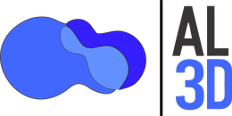

  <picture>
    <source media="(prefers-color-scheme: dark)" srcset="logo-al3d-dark.png">
    
  </picture>

<h1 align="center">Cotizador AL3D</h1>

  Cotizador de anuncios luminosos: letras 3D, recorte de acrílico, bastidores y cajas de luz.

  <a href="https://eliasgaribi-ctrl-z.github.io/cotizador-al3d/"><b>▶ Abrir el cotizador</b></a>

---

## Qué hace

- **Partidas por tipo** — letras 3D, recorte de acrílico, bastidor, caja de luz o captura manual, cada una con su catálogo de materiales y tarifas. En letras 3D los materiales van de aluminio pintado ($30/cm) a **acero inoxidable ($55/cm)**. Si borras una partida por error, el aviso trae **Deshacer** — y también lo trae *Vaciar y empezar cotización nueva*, que es lo que más duele perder.

  Capturando a mano, la partida nueva **hereda el material de la anterior** —el único campo que hay que elegir en todas y que casi nunca cambia dentro del mismo trabajo—. Va marcado con «↩ como la anterior» para que se vea que lo puso la app y no tú: es el dato que más pesa en el precio. En cuanto eliges uno a mano, la etiqueta se quita y ese pasa a ser el que hereden las siguientes. Las partidas que crean el escalador y el vectorizador siguen naciendo sin material, porque ahí nacen de una medida y el material sí sería una suposición con precio. Junto a *+ Agregar partida* está **⧉ Igual que la anterior**, que copia la última completa.

- **Partidas plegadas: solo lo que se está cotizando** — una partida abierta enseña el catálogo completo con el que se captura: los cinco materiales, las tres complejidades, los tres acabados. Multiplicado por cada renglón de la cotización, eran 3 000 px de opciones para leer dos datos. Plegada se recoge a **la descripción, lo que ya está elegido y su total** —«Letrero de fachada FARMACIA · ✓ Acero Inoxidable · ✓ Cursiva · ✓ Luz cálida · ✓ 40 cm · ✓ 14 letras»— y se abre con un toque, en la fila completa o en el ▾ del encabezado.

  Lo que falta se resume en **una** ficha ámbar con su cuenta («Faltan 2 datos»), porque una partida recién creada tiene tres huecos y una ficha por hueco convertía a la partida más vacía en la que más ruido hacía; el itemizado se lee abajo, en el renglón de la fórmula, con sus propias palabras. De lo apagado solo se enseña lo que mueve el precio: «Sin iluminación · −20%» se queda, «Sin complejidad» —que es el valor por omisión de uno de los tres acabados— se cae. Y si la partida está oculta del PDF, lo dice con palabras y no solo con el gris.

  Al agregar una partida las anteriores se pliegan solas, y al abrir una cotización guardada solo queda desplegada la última; **Plegar todas / Abrir todas** en el encabezado de *Partidas* hace las dos cosas de golpe. Nació como arreglo del teléfono y durante un tiempo solo funcionó ahí, pero el problema no era del teléfono: era de las partidas. Es solo una manera de ver la pantalla: no se guarda con la cotización, no viaja al PDF y un Ctrl+P saca el detalle completo.
- **El cliente que ya conoces** — al escribir en *Cliente* se sugieren los del historial; al elegir uno se llenan teléfono, dirección y link de Maps, pero **solo los campos que estén vacíos**: nunca se pisa lo que ya escribiste.
- **Cliente, teléfono y proyecto van antes que la primera partida** — antes bastaba con el cliente *o* el proyecto, y el teléfono no se pedía nunca; salían cotizaciones autorizadas sin saber de quién eran, sin distinguirse de las otras tres del mismo cliente o sin un número al que mandarlas por WhatsApp, que es justo para lo que existe el botón de enviar. Los tres pasaron a ser obligatorios, pero el freno estaba solo al final, al mandar a autorización —y al final es donde corregir cuesta más—: la cotización ya está capturada entera y lo que falta es justo lo que nadie se acuerda de preguntar, el teléfono, con el cliente ya colgado.

  Ahora se piden **antes de la primera partida**. Hasta que no estén los tres, no se agrega una partida ni se duplica, no entra la IA, no bajan las medidas del escalador ni el trazo del vectorizador, y no se escribe dentro de una partida que ya estuviera capturada. No es un requisito nuevo: es el mismo de siempre, movido al único momento en que preguntarlo sale gratis, que es cuando todavía no hay nada capturado que corregir.

  Lo que **sí** se puede hacer con el candado puesto es leer la cotización entera, plegar y abrir sus partidas, imprimirla —el papel sale igual que siempre, sin lo apagado y sin la ficha— y **deshacer un borrado**: restituir no es capturar, y era el único punto donde este candado podía perder trabajo. El «Deshacer» de una partida dura seis segundos, y si en esos seis segundos el vendedor se fue a corregir el teléfono —lo borró para reescribirlo—, un candado que también lo frenara se llevaría la partida para siempre.

  La tarjeta de *Partidas* lo dice con palabras y nombra lo que falta —«Primero, de quién es la cotización. Falta el teléfono del cliente»—, y tocar el aviso lleva ahí. *+ Agregar partida* **no se apaga**: un botón gris no explica por qué está gris, y aquí el porqué es justo el siguiente paso, así que se queda vivo, nombra el hueco, lo marca en ámbar y deja el cursor dentro. **Nada se queda callado**: tocar un chip o un recuadro de una partida congelada también contesta —un control que se ve y no responde es, palabra por palabra, «la app se rompió»—, aunque desde dentro de la partida solo avisa y no arrastra la pantalla hasta arriba. En el celular la barra fija de abajo deja de mostrar un *Autorizar yo mismo* muerto y muestra el siguiente paso real: «Falta el teléfono del cliente ›». El candado se quita **solo**, en cuanto se termina de escribir el último de los tres —sin guardar, sin recargar, sin apretar nada—, y la cotización se queda con la partida en blanco con la que siempre ha arrancado la app.

  Una cotización vieja que se abra sin teléfono conserva sus partidas a la vista, apagadas: se leen y no se pierden, y se destraban escribiendo el dato que falta. Ahí el aviso cambia de encabezado —«Esta cotización no trae los datos del cliente»—, porque un «primero, de quién es» encima de cinco partidas ya capturadas se lee como que la app se equivocó de cotización. No es un estado del día del estreno que se vaya solo: un respaldo que llegue por WhatsApp puede traer una cotización sin teléfono en cualquier momento. El escalador y el vectorizador siguen abriéndose con la cotización en blanco, porque medir no es capturar; lo que frena es el botón que baja esas medidas a las partidas.

  Los tres se vuelven a exigir al mandar a autorización, que es donde el precio se bloquea. Si falta alguno, el aviso los nombra («faltan el teléfono del cliente y el proyecto»), los huecos se marcan en ámbar y el cursor queda en el primero, abriendo los datos del proyecto si estaban plegados. Del teléfono se cuentan **dígitos, no formato**: «33 1234 5678» y «+52 33 1234 5678» valen igual, y un «33» a medias no pasa, porque un teléfono incompleto engaña más que uno vacío —parece capturado—. *Autorizar yo mismo* pasa por el mismo filtro: autorizarse a uno mismo no es una puerta de servicio para saltarse los datos del cliente.
- **Completitud dice qué falta, no solo cuánto** — la barra del resumen nombra lo primero pendiente («Falta la dirección», «Partida 2 · falta material») y tocarla lleva ahí: abre los datos del proyecto si estaban plegados y enfoca el campo, o despliega la partida. Cuando no falta nada se apaga.
- **Cotizar con IA** — analiza un JPG o PDF del proyecto y propone las partidas. Si ya tienes trabajo capturado, lo **conserva** y agrega las de la IA al final; reemplazar sigue a un toque, pero ahora es una decisión que se toma a propósito y no por omisión. También puede analizar **la imagen que acabas de medir en el escalador**, con tus cotas: ahí las medidas ya no las estima, las toma tal cual. La imagen analizada se guarda con la cotización, así que sigue ahí si recargas o cierras la pestaña.

  **Varias APIs, para que ninguna detenga la cotización.** Cada proveedor admite **hasta 8 keys**, no una. En los planes gratuitos la cuota va por key —no por proveedor—, así que dos cuentas de Google son dos cuotas de Gemini; se pegan una tras otra con *Agregar* y quedan listadas como Key 1, Key 2, Key 3. Entre análisis **se turnan**, para repartir la cuota del día en vez de quemar siempre la primera hasta agotarla.

  **Cuando una se cae, insiste la app y no tú.** Los planes gratuitos contestan «model is overloaded» (503) o «rate limit» (429) a cualquier hora, y eso salía como un error seco que obligaba a volver a pulsar *Analizar* hasta que sonara la flauta. Ahora la app recorre sola la lista: reintenta con esperas crecientes cuando el modelo está saturado —es cuestión de tiempo—, pero ante un 429, que es cuota de **esa** key, salta al instante a la siguiente key, luego a los modelos hermanos del proveedor y por último a los otros proveedores configurados. Solo usa keys guardadas en este dispositivo: nunca manda nada a un proveedor que no hayas cargado. En pantalla se ve con quién está hablando (`Gemini · gemini-2.5-flash · key 2`), y si acabó contestando **otro modelo** lo avisa, porque el borrador viene de otra IA y quien lo revisa tiene derecho a saberlo. Los errores que no se arreglan reintentando —key inválida, modelo inexistente— no gastan intentos.

  Con eso se arreglaron de paso los otros dos: Groq y OpenRouter rechazan el modo JSON del API cuando en la misma petición va una imagen, así que la app repite sin él y lee igual el JSON de la respuesta. Las fotos se reducen a 1600 px antes de subirlas —una foto de celular pesa varios MB y Groq la rechazaba por tamaño—, y un PDF con Groq u OpenRouter elegidos ya no es un callejón sin salida: si la key de Gemini está guardada, se usa esa.
- **Escalador de imagen** — mide elementos sobre una foto o plano sin cotas: se calibra con una referencia conocida y de ahí se sacan las demás medidas. Con el dedo, cada toque coloca un punto y deslizando sin soltar se afina con lupa antes de dejarlo; los extremos ya trazados se arrastran para corregir la medida sin borrarla, y mover la referencia recalcula todas. El botón **← Cotizador** de arriba, el que queda pegado al pie del panel y el "atrás" del celular regresan a la cotización en cualquier momento.

  Al terminar de medir hay dos salidas. **Agregar como partidas** crea una partida por medida, con la altura puesta y lo demás por capturar. **✨ Cotizar estas medidas con IA** manda esa misma foto —con las cotas dibujadas encima— y la lista de medidas a la misma IA del cotizador, que devuelve las partidas ya clasificadas: tipo, material, complejidad, iluminación y número de letras, con tus medidas exactas y sin redondear. El mismo botón está en la vista previa de la imagen, junto a las partidas. Si la IA devuelve un número de partidas distinto al de medidas, te lo dice para que revises cuál falta.
- **Vectorizador de imagen** — convierte el JPG que manda el cliente en trazo vectorial: el contorno con el que se corta el acrílico o el aluminio. Tres modos —**Corte** (una silueta), **Logotipo** (pocos colores planos) y **Foto**— con una cortina para comparar el original contra el trazo, y control de detalle, motas, esquinas y fondo. El número de colores es un tope: si el logotipo trae menos, salen menos.

  Dando el **alto o el ancho real** del diseño, el SVG se descarga a escala y abre con las medidas puestas en Illustrator, CorelDRAW o el software de corte, sin reescalar a ojo. De ahí salen también los dos datos que mueven el precio de unas letras 3D: **cuántas piezas son** —cada letra es un contorno, y el hueco de una "O" no cuenta como pieza— y **qué alto tienen**. **Agregar como partida** crea la partida de letras 3D con esos dos campos llenos; el material y la complejidad los sigues eligiendo tú, porque son los que cambian el precio. También enseña el **perímetro de corte** en metros, que es el recorrido del láser.

  **Medir el vector en el escalador** manda el trazo limpio al escalador y, si ya diste la medida real, entra ya calibrado. Medir sobre el vector es más exacto que sobre la foto: los bordes están donde de verdad se va a cortar y no donde el JPG los difuminó.
- **Autorización** — el precio se bloquea al solicitar autorización, y quien autoriza puede ajustar el total o partida por partida, hacia abajo o hacia arriba; ese precio es el que manda en el PDF, el anticipo y el registro de venta.

  **El bloqueo no depende de que nadie apriete nada.** Al autorizar se guarda la huella del trabajo —qué partidas, con qué material, qué medidas, con IVA o sin él— y el precio autorizado vale mientras esa huella siga siendo la misma. En cuanto algo cambia, el precio vuelve al calculado y la app lo dice: no hace falta pasar por «Guardar» ni acordarse de nada, así que recargar la página a medio editar tampoco deja una cotización autorizada en el precio de otras partidas. El interruptor del IVA queda bloqueado con las partidas, porque mueve el total un 16%. Lo que sí sigue editable después de autorizar es lo que **no** mueve el precio: las entre calles, el límite de fabricación, la nota al cliente y el anticipo, que se pacta justo al cerrar.

  Si una partida trae un precio puesto a mano por el autorizador, el renglón enseña **ese** —con el calculado tachado al lado—, que es el que va a salir impreso. Antes la pantalla decía uno y el PDF otro.

  **Mientras es borrador, los importes salen difuminados.** Se captura delante del cliente y el precio no tiene por qué leerse desde el otro lado de la mesa antes de estar autorizado: se difuminan el total de cada partida, el subtotal, el IVA, el total neto y el anticipo, y también las cifras de la fórmula de cada partida —«▓▓▓ (▓▓▓) × 30cm × 6»—, porque con el «$55 × 30cm × 6» a la vista el precio se calcula de cabeza. Las medidas de la fórmula sí se quedan legibles: la altura y el número de letras son lo que se está capturando. Se espían manteniendo uno tocado —se destapan todos a la vez y se vuelven a tapar al soltar—, o con el botón **Ver precios** del aviso, que los deja destapados hasta volver a pulsarlo y es la manera de leerlos sin dedo ni ratón. Se destapan solos al solicitar autorización, porque de ahí en adelante el precio ya es un dato firme, y un Ctrl+P nunca los imprime borrosos. Las tarifas de los chips de material siguen a la vista: ésas son el catálogo con el que se captura, no el precio del trabajo. Con las partidas plegadas también se tapan las dos fichas que llevan precio de **este** trabajo —la tarifa personalizada de una caja de luz y el precio unitario de una partida manual—, que se escapaban; tocarlas las destapa sin abrir la partida, porque ahí el gesto es espiar. El autorizador nunca los ve tapados.

  La cola del autorizador solo muestra las solicitudes hechas en **ese mismo dispositivo**, y la pantalla lo dice: se guarda ahí, no en un servidor. Cuando el vendedor y el autorizador son la misma persona —que es lo normal, justo por eso—, **⚡ Autorizar yo mismo** abre ese mismo formulario de revisión dentro de la vista de vendedor, sin cambiar el rol de arriba ni volver a cambiarlo después. Es el mismo formulario, así que no hay dos maneras de autorizar que puedan contradecirse. *Solicitar autorización a alguien más* sigue ahí para el flujo de dos personas. El nombre de quien autoriza se recuerda en el dispositivo.

- **Aviso de partidas sin terminar** — una partida de letras sin material vale $0, y antes bastaba con que otra partida tuviera precio para que la incompleta pasara el filtro, se autorizara y saliera en el PDF como un renglón normal, con su descripción bien redactada, en **$0.00**. Ahora, al solicitar o al autorizar, si hay partidas incompletas se listan primero —«Partida 2 · falta material»— y se toca cada una para ir a completarla; las que están completamente vacías se quitan desde ahí mismo. Se puede continuar de todos modos, pero avisado. Si no falta nada, no agrega ni un toque.
- **PDF de cotización** con el logotipo, el cliente, el desglose de partidas, IVA, descuento autorizado, anticipo y resta al entregar. Cuando el autorizador dio un descuento, el descuento baja la base y el IVA sale de la base descontada, así que el papel cuadra consigo mismo: subtotal menos descuento, más IVA, es exactamente el total a pagar. Las partidas se reparten por hoja: antes, pasando de unas veinte, la tabla crecía más que la hoja carta, se partía en dos y la primera se quedaba sin el pie con el vendedor, el taller y el WhatsApp.
- **Enviar por WhatsApp** — abre el chat del teléfono que capturaste con el mensaje ya escrito: folio, proyecto, total autorizado, anticipo y límite de fabricación. **El PDF se adjunta a mano**, y no es descuido: lo que la app llama «PDF» es una página que se manda a imprimir, no un archivo, así que no hay nada que adjuntar por programa.
- **Registrar venta** — anticipo, comisión, estatus y saldo pendiente, calculados sobre el precio realmente autorizado. El porcentaje de comisión y la cuenta se recuerdan.
- **Historial** de cotizaciones guardado en el propio dispositivo, con los importes **congelados** al momento de autorizar —el catálogo de precios se edita a mano en este mismo archivo, y sin congelarlos subir el precio del aluminio reescribía hacia atrás lo que ya se le había cotizado a un cliente—, con buscador y dos maneras de reusar una cotización: **↻ Abrir y editar** la trae tal cual, autorizada, para regenerar su PDF o para modificarla —al cambiar las partidas el precio autorizado se suelta y hay que volver a autorizarlo, porque el que aprobó una persona ya no corresponde a ese trabajo—; **⧉ Duplicar** copia los datos del cliente y las partidas a una cotización **nueva** —folio nuevo, en borrador, con el precio recalculado y sin arrastrar nada de la autorización anterior—, que es lo que se necesita cuando el mismo cliente pide otro letrero o el local de junto quiere lo mismo con otra medida. Tus plantillas son tus cotizaciones anteriores.

## Uso

Todo corre en el navegador, sin instalar nada. Desde el celular conviene abrir la liga y agregarla a la pantalla de inicio (Chrome → menú → *Agregar a pantalla principal*; en iPhone, Safari → *Compartir* → *Agregar a inicio*) para que quede como aplicación, a pantalla completa y sin la barra del navegador.

**Y abre sin señal.** La app guarda una copia de sí misma en el teléfono la primera vez que se abre con datos, así que en la calle —o en un local sin señal— sigue arrancando y el historial, los folios y la cotización en curso, que están en *ese* teléfono, siguen alcanzables. Lo que sí necesita conexión es *Cotizar con IA*, y leer un PDF en el escalador o el vectorizador la primera vez de cada sesión, porque el lector de PDF se descarga en ese momento; si no hay red, lo dice con esas palabras en vez de un error seco.

En el teléfono la pantalla se acomoda sola y se aprovecha completa:

- **Partidas plegadas.** Es lo que más se nota aquí —una partida de letras mide 1 293 px en un iPhone—, aunque ya funciona en cualquier pantalla: está descrito arriba, en *Qué hace*.
- **Barra de arriba a la mitad.** Al desplazarse, el logotipo se va y se queda pegado únicamente el renglón que se usa —folio, rol e historial—: de 115 px fijos a unos 50.
- **Barra fija abajo** con el total y el siguiente paso —solicitar autorización, generar el PDF, lo que toque según el estado—, ya sin tapar el final de la página en los iPhone con franja de gesto.
- Los cinco tipos de partida caben en un solo renglón, las opciones de material y acabado van en dos columnas, y la tarjeta de *Datos del proyecto* se pliega con un toque para dejar las partidas hasta arriba.
- Cada partida nueva se trae a la vista al crearla, todo lo tocable mide 40 px o más, y los campos de medidas abren el teclado numérico.

## Respaldar y mover los datos

Los datos —historial, folios, cotización en curso, logotipo— se guardan localmente en cada dispositivo y no se sincronizan entre ellos. Eso se pierde al borrar los datos del navegador, al cambiar de teléfono o cuando iOS limpia los sitios que llevan semanas sin abrirse.

En el pie del historial hay tres botones:

- **⬇ Respaldar** descarga un archivo con todo lo que la app guarda en ese teléfono.
- **⬆ Restaurar** lo devuelve. Reemplaza lo que haya, así que antes de escribir nada descarga solo un respaldo de lo que estaba, por si acaso.
- **📄 CSV** exporta el historial completo —folio, cliente, teléfono, proyecto, quién autorizó, totales y el detalle de partidas— para pegarlo en Google Sheets.

El respaldo **no incluye las API keys** a propósito: un respaldo se manda por WhatsApp o por correo, y una key que viaja así deja de ser secreta. Se vuelven a pegar en el teléfono nuevo, que es un minuto.

Un aviso: el contador de folios también es por dispositivo. Si cotizas desde dos aparatos distintos, los dos empiezan en `COT-0001` y vas a acabar con folios repetidos; mientras no haya sincronización de verdad, conviene cotizar siempre desde el mismo.

Dentro de *Datos del proyecto* hay un bloque plegable, **Datos que salen en el PDF**, con las entre calles, el límite de fabricación y la nota que se imprime para el cliente. Esos tres campos siguen editables después de autorizar, porque normalmente la fecha de entrega se define justo en ese momento. La nota que escribe el autorizador es interna y no aparece en el documento del cliente.

## Actualizar la versión publicada

El sitio se sirve desde `index.html` en la rama `main`. Para publicar cambios:

1. Renombrar el HTML nuevo a **`index.html`**.
2. Subirlo en [/upload/main](https://github.com/eliasgaribi-ctrl-z/cotizador-al3d/upload/main) y hacer commit a `main`.
3. Esperar entre 30 y 60 segundos a que GitHub Pages redespliegue.

Sigue siendo un solo archivo el que se edita. Junto a él viven dos piezas que se subieron una vez y no hay que volver a tocar: **`sw.js`**, que es lo que hace que la app abra sin señal, y **`manifest.webmanifest`**, que es lo que hace que Android la instale como aplicación y no como acceso directo. Si alguna vez se borran, la app sigue funcionando con conexión.

Si el celular sigue mostrando la versión anterior, es la caché: recargar forzando o abrir la liga con `?v=2` al final. La copia local no estorba a esto —pide siempre la versión del servidor primero y solo usa la guardada cuando no hay red—, así que publicar y recargar alcanza.

---

AL3D · Anuncios Luminosos 3D · Guadalajara, Jalisco

