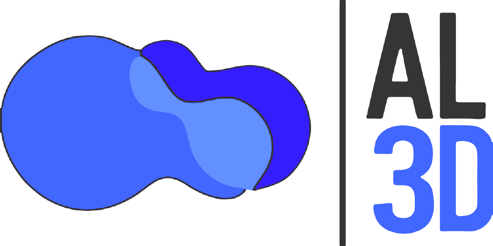
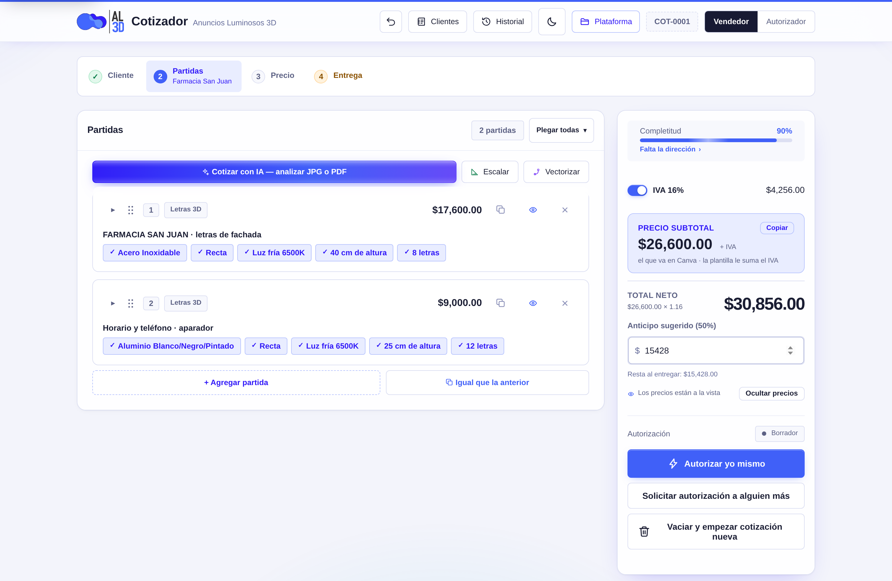
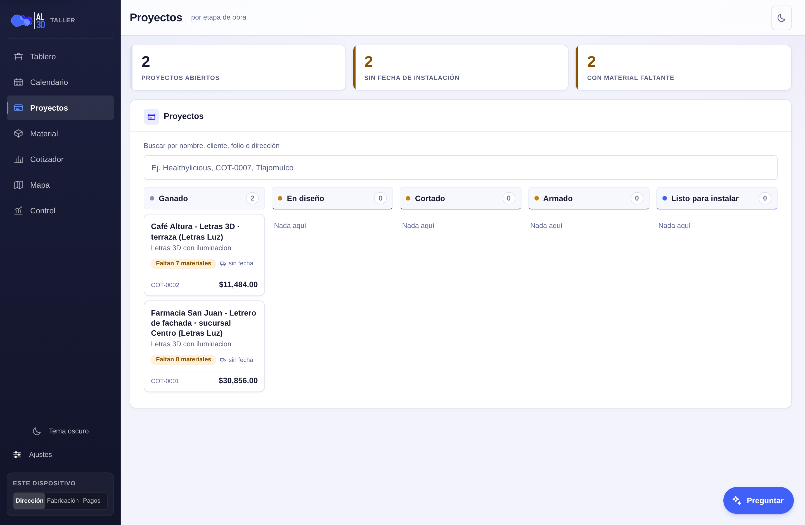

  <picture>
    <source media="(prefers-color-scheme: dark)" srcset="logo-al3d-oscuro.svg">
    
  </picture>

<h1 align="center">Cotizador AL3D</h1>

  <b>Se cotiza delante del cliente, y el taller se entera solo.</b> 
  Letras 3D, recorte de acrílico, bastidores y cajas de luz — del precio a la orden de trabajo.

  
  
  
  

---

  

## Qué es

Tres herramientas que comparten una sola puerta, un solo sistema de diseño y un solo conjunto
de archivos publicado:

| | Qué hace | Dónde vive |
|---|---|---|
| **Cotizador** | Captura el trabajo delante del cliente y saca el precio, el PDF y el WhatsApp | `#/cotizador` |
| **Plataforma** | Lo que pasa después: calendario, obra, material, mapa, cobranza | la raíz, `#/hoy` |
| **Anidador** | Acomoda las piezas en la lámina antes de cortar | `/anidador-vectores/` |

Todo corre en el navegador. **Sin servidor, sin cuenta, sin instalar nada y sin build**: son
archivos estáticos que GitHub Pages sirve tal cual. Los datos viven en el dispositivo.

## El eslabón: de la cotización al taller

El cotizador termina en «autorizada» y ahí se detenía. Lo que venía después —que el cliente
diga sí, cuándo se instala, qué material comprar, cuánto deben— vivía en la cabeza de alguien.

Hoy, en *Registrar venta* hay un botón —**Registrar como proyecto ganado**— y del otro lado
aparece el proyecto completo: cliente, teléfono, dirección, el punto en el mapa sacado del link
de Google Maps, el tipo de trabajo derivado de las partidas, la fecha de instalación y **el
material que hay que comprar**. Nada de eso se captura.

  

## Lo que hace el cotizador

> El detalle completo —por qué cada pantalla es como es y qué se descartó— está en
> [`docs/FUNCIONES.md`](docs/FUNCIONES.md).

- **Cuatro pasos: Cliente · Partidas · Precio · Entrega.** La barra dice en cuál estás, cuáles
  están hechos y cuál no toca todavía. Ninguno se deshabilita: tocar el que no toca dice qué falta.
- **Partidas por tipo** — letras 3D, recorte de acrílico, bastidor, caja de luz o captura manual,
  cada una con su catálogo de materiales y tarifas. Por debajo de 10 cm no hay letras 3D: la
  regla se aplica sola y la partida se convierte en recorte de acrílico, diciendo por qué.
- **Cotizar con IA** — analiza un JPG o PDF del proyecto y propone las partidas. Hasta 8 llaves
  por proveedor (Gemini, Groq, OpenRouter), que se turnan y se relevan solas cuando una se cae.
- **Escalador** — mide sobre una foto o un plano sin cotas: se calibra con una referencia
  conocida y de ahí salen las demás medidas, con lupa para afinar con el dedo.
- **Vectorizador** — convierte el JPG del cliente en trazo de corte, a escala real, y saca los
  dos datos que mueven el precio: cuántas piezas son y qué alto tienen.
- **Autorización con huella** — el precio se bloquea al autorizar y vale mientras el trabajo no
  cambie. En cuanto cambia, vuelve al calculado, lo dice y ofrece **volver a autorizarlo** sobre
  el mismo folio. El ajuste se teclea **sobre el subtotal, sin IVA**, y cuando hay ajustes por
  partida la app nombra contra qué base se mide.
- **PDF de cotización** con el plano del anuncio, la orden de trabajo del taller y el recibo de
  pago con talón. Un descuento se le enseña al cliente; un aumento se reparte entre las partidas.
- **Deshacer con Ctrl+Z**, hasta 60 pasos, agrupando lo que se teclea seguido en un mismo campo.
- **Historial y cuadernos de cliente** — el historial contesta «¿qué cotizamos?»; el cuaderno,
  «¿quién es este y qué le hemos hecho?». No hay alta de clientes: se arma solo con lo capturado.
- **Los importes salen difuminados mientras es borrador**, porque se captura delante del cliente.
  Se espían manteniendo tocado, o con *Ver precios*.
- **Abrir la app no es recargar la página.** La cotización se guarda sola en cada tecla y una
  recarga la devuelve entera; pero al ABRIR la app, la de antes ya no se hereda en silencio: si
  ya estaba guardada en el historial, se empieza en blanco —con *Deshacer* a la mano—, y si es la
  única copia que existe se queda en pantalla con un aviso que dice **de quién es**. Así el
  trabajo nuevo deja de guardarse a nombre del cliente anterior.

## La plataforma

- **Calendario** — dos lentes: **Taller**, la fila de lo que está en fabricación con su ventana
  contada hacia atrás desde el día de instalación; e **Instalaciones**, el mes con su semáforo.
- **Tablero** — lo que se rompe primero, en orden: «falta material y esto se instala en 2 días».
- **Proyectos** — el tablero por etapa de obra, con la orden de trabajo de fabricación.
- **Material** — de «8 letras de 40 cm de acero» a «1 lámina de acrílico, 44 módulos LED, 1
  fuente», con la cuenta a la vista y su etiqueta de confianza.
- **Mapa** — las obras por instalar y las instaladas, con el orden de ruta del día.
- **Control** — el dinero: lo vendido contra el mes anterior, la conversión, los últimos doce
  meses, la cartera con el WhatsApp de cobro ya escrito, y la bitácora de quién movió qué. **El
  récord de ventas es el de la hoja de finanzas**: el puente baja la pestaña Ventas entera
  —también lo que se registró desde otro teléfono o en la propia hoja— y Control la suma con lo
  de este aparato, dice de cuándo son los datos y los vuelve a traer con un botón (y solo, al
  entrar, si tienen más de diez minutos).
- **El asistente** — un botón que flota en las ocho pantallas. Las siete preguntas de siempre se
  contestan **aquí, sin IA y sin señal**; lo que no se puede calcular va a la IA sin teléfonos
  ni direcciones.

**Los recordatorios que sí suenan.** Cada instalación descarga un evento para el calendario del
teléfono, con alarmas a 3 días, 1 día y 30 minutos: las dispara el calendario, no la app, y por
eso suenan aunque nadie abra nada. Los demás avisos se calculan al abrir la plataforma.

**La hoja de cálculo es el libro mayor.** Los proyectos ganados, las fórmulas de comisión y la
cobranza viven en **«Finanzas AL3D — Ventas y Comisiones»**. En **Ajustes → El puente** se pega
la liga del Apps Script de esa hoja y el token de este teléfono, y a partir de ahí la venta sale
sola y el espejo del dinero baja solo — **y solo a quien le toca verlo**: al teléfono de
fabricación las cifras no le bajan. Baja también el **récord de ventas completo** de la hoja, que
es lo que Control suma: una fila que se borra allá desaparece de aquí en la siguiente bajada.
Sin puente no se rompe nada: la plataforma funciona completa en un dispositivo, y Control lo dice
en su primera línea. Los pasos están en [`puente/README.md`](puente/README.md).

## El anidador de vectores

Antes de mandar las piezas al láser o al CNC conviene acomodarlas para gastar el menor material
posible. Vive en [su propia página](https://eliasgaribi-ctrl-z.github.io/cotizador-al3d/anidador-vectores/)
porque es del taller y no de la venta, y se llega desde el botón **Anidador** de la plataforma o
desde **Acomodar en hoja** del vectorizador, que lo abre con el trazo ya puesto.

Trabaja en milímetros y lo que no es una medida lo pregunta: si el SVG declara mm, cm, pulgadas
o puntos se convierte solo; si viene en `px` —que en SVG no es una medida— se pide el ancho real
en vez de adivinar. Se detiene solo cuando lleva 25 intentos sin mejorar. Corre completo en el
navegador con [SVGnest](https://github.com/Jack000/SVGnest); ningún archivo se sube a un servidor.

## Uso

Todo corre en el navegador. Desde el celular conviene abrir la liga y agregarla a la pantalla de
inicio (Chrome → menú → *Agregar a pantalla principal*; iPhone → Safari → *Compartir* → *Agregar
a inicio*) para que quede como aplicación, a pantalla completa.

**Y abre sin señal.** La app guarda una copia de sí misma la primera vez que se abre con datos,
así que en la calle sigue arrancando y el historial, los folios y la cotización en curso siguen
alcanzables. Lo que sí necesita conexión es *Cotizar con IA*, y leer un PDF la primera vez de
cada sesión.

## Respaldar y mover los datos

Los datos se guardan localmente en cada dispositivo y **no se sincronizan entre ellos**. Eso se
pierde al borrar los datos del navegador, al cambiar de teléfono o cuando iOS limpia los sitios
que llevan semanas sin abrirse. La app lo pide sola: apunta la fecha del último respaldo y lo
nombra al autorizar si lleva más de treinta días o diez cotizaciones sin respaldarse.

En el pie del historial hay cuatro botones: **⬇ Respaldar** descarga un archivo con todo lo de
ese teléfono, **⬆ Restaurar** lo devuelve (y antes guarda solo un respaldo de lo que estaba),
**📄 CSV** exporta el historial para pegarlo en una hoja y **📓 Clientes** lo cruza por cliente.

El respaldo **no incluye las API keys** a propósito: se manda por WhatsApp o correo, y una llave
que viaja así deja de ser secreta.

> **Un aviso:** el contador de folios también es por dispositivo. Si cotizas desde dos aparatos,
> los dos empiezan en `COT-0001`. Mientras no haya sincronización, conviene cotizar siempre desde
> el mismo.

## Una sola puerta

| Por dónde se entra | A dónde llega |
|---|---|
| La liga de siempre, `…/cotizador-al3d/` | El **Tablero** del taller, con el Cotizador como pestaña |
| El icono de la app instalada | El Tablero |
| Una liga vieja o un marcador a `cotizador.html` | Reenvía a `./#/cotizador` |
| `cotizador.html?solo=1` | El cotizador solo, sin la app alrededor. Lo usan las pruebas |
| Doble clic en `cotizador.html` desde el disco | El cotizador solo, como siempre |

## Cómo está acomodado el código

    cotizador.html            solo el marcado (900 líneas)
    css/sistema.css           EL sistema de diseño: tokens, estructura, las ocho capas
    css/plataforma.css        lo que solo la plataforma tiene (calendario, almacén, mapa)
    css/vidrio.css            la capa de vidrio, y va LA ÚLTIMA de las tres páginas: repinta
                              las dos familias y el cromado. Si se quita, la app vuelve a como estaba
    js/tema.js                claro, oscuro o el del sistema; corre antes del primer pintado
    js/cotizador/             el cotizador, por dominio y en el orden en que se carga:
      catalogo.js               precios — lo único que se edita a mano cuando sube el aluminio
      nucleo.js                 estado, modales, preferencias, clientes conocidos, cálculo
      partidas.js               agregar, plegar, heredar, pintar, chips y resumen
      proceso.js                los cuatro pasos, la autorización, la barra fija del teléfono
      ia.js                     cotizar con IA: proveedores, llaves, archivo, reintentos
      entrega.js                logotipo, WhatsApp, hitos, Canva y el generador de PDF
      historial.js              historial, cuadernos, respaldo, cola, deshacer, folio
      escalador.js              medir sobre la foto
      venta.js                  registrar la venta y la vuelta a la plataforma
      vectorizador.js           imagen a trazo de corte
      arranque.js               init(), al final, porque llama a todos los demás
    js/app.js + js/mod/       la plataforma: router y sus módulos ES
    js/datos/, js/nucleo/     la capa de datos y las primitivas de pantalla

Los once de `js/cotizador/` son scripts **clásicos** que comparten el ámbito global, como cuando
eran un solo `<script>`: los 157 manejadores en línea del marcado dependen de eso, y portarlos a
módulos ES los dejaría mudos sin un solo error. `pruebas/sintaxis.mjs` compila los once y
`pruebas/publicacion.mjs` vigila que `arranque.js` siga siendo el último.

## Publicar

El sitio se sirve desde `main` y **es un solo conjunto de archivos que se promociona completo**.

> **Quién es quién.** La raíz —`index.html`— es **la app**: el Tablero, el calendario, el
> material, y el Cotizador como una de sus pestañas. `cotizador.html` es el cotizador, que la app
> empotra. Subir el cotizador como `index.html` borra la puerta de entrada.

1. Hacer commit a `main` (o fusionar el PR).
2. En **`sw.js`**, subir **`APP_VERSION`** una unidad. Es la primera línea de código del archivo.
   Sin eso, los teléfonos que ya tienen la app siguen sirviendo la versión guardada.
3. Esperar de 30 a 60 segundos a que GitHub Pages redespliegue.

Son setenta y cuatro archivos que se cargan en orden y se llaman entre sí, servidos *caché primero*: con
mala señal llegarían mezclados, y **un guion nuevo con uno viejo no es una app vieja, es una app
rota**. Por eso el conjunto se cambia completo o no se cambia.

Si cambia el catálogo de precios (`js/cotizador/catalogo.js`), hay que regenerar su copia para la
plataforma con `herramientas/extraer-catalogo.sh`.

## Pruebas

    pruebas/correr.sh               22 archivos, solo node, unos segundos
    pruebas/correr.sh --navegador   17 más, que piden Chromium y un servidor

Una de ellas revisa que el sitio *se pueda publicar*; otra corre el Apps Script del puente entero
contra una hoja de mentiras, sin cuenta y sin red; otra rasteriza cada pieza y **cuenta sus
píxeles** para comprobar que nada de lo que lleva texto baja de 4,5:1 de contraste.

## Documentación

| Documento | Qué contiene |
|---|---|
| [`docs/FUNCIONES.md`](docs/FUNCIONES.md) | El cotizador por dentro: por qué cada pantalla es como es |
| [`docs/ARQUITECTURA.md`](docs/ARQUITECTURA.md) | El contrato completo: fases, modelo de datos, cada módulo |
| [`docs/SISTEMA-DE-DISENO.md`](docs/SISTEMA-DE-DISENO.md) | Tokens, escalas y las ocho capas de `css/sistema.css` |
| [`docs/INVESTIGACION-TECNICA.md`](docs/INVESTIGACION-TECNICA.md) | Lo que se verificó antes de decidir: OAuth, cuotas, límites |
| [`docs/ESTRUCTURA-COTIZACION-CANVA.md`](docs/ESTRUCTURA-COTIZACION-CANVA.md) | El papel que se manda de verdad, hoja por hoja |
| [`puente/README.md`](puente/README.md) | El puente a la hoja: caminos, roles y cómo está cerrado |

## Pendientes

- **Los folios se repiten entre dispositivos.** El contador es local a cada teléfono. La
  plataforma lo desempata por dentro con el identificador del aparato, pero el folio que el
  cliente tiene en la mano sigue pudiendo repetirse.
- **El puente lleva la venta, y por ahora nada más.** El almacén, el catálogo de material y las
  listas de compra no tienen todavía pestaña en la hoja a la que ir, así que se quedan en cada
  dispositivo. No se pierden: se apartan en la bandeja con su razón y se reincorporan solos el
  día que existan.
- **Los modales traen tamaños del sistema viejo.** El escalador, el vectorizador y el historial
  heredan los tokens nuevos, pero sus medidas internas son de antes de la escala de siete tamaños.
- **El neón flex se vende y no está en ningún catálogo.** Cae en partida *manual*, que es justo
  la que el módulo de material excluye por diseño. Es un hueco de negocio: falta decidir cómo se
  cobra.

---

AL3D · Anuncios Luminosos 3D · Guadalajara, Jalisco

