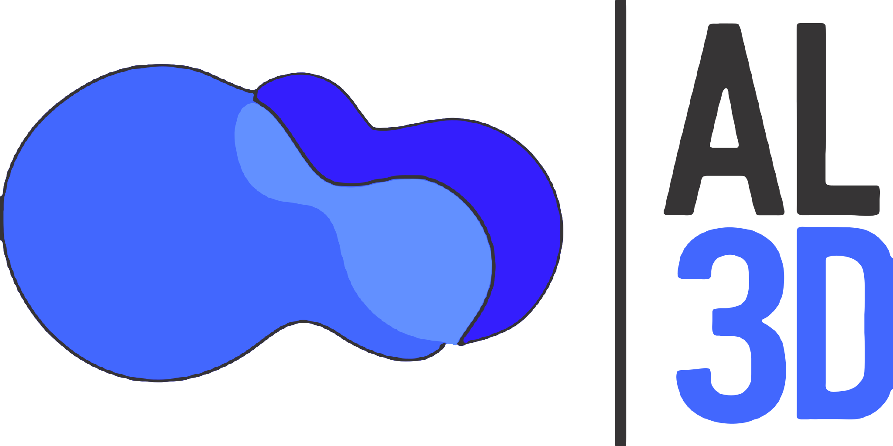
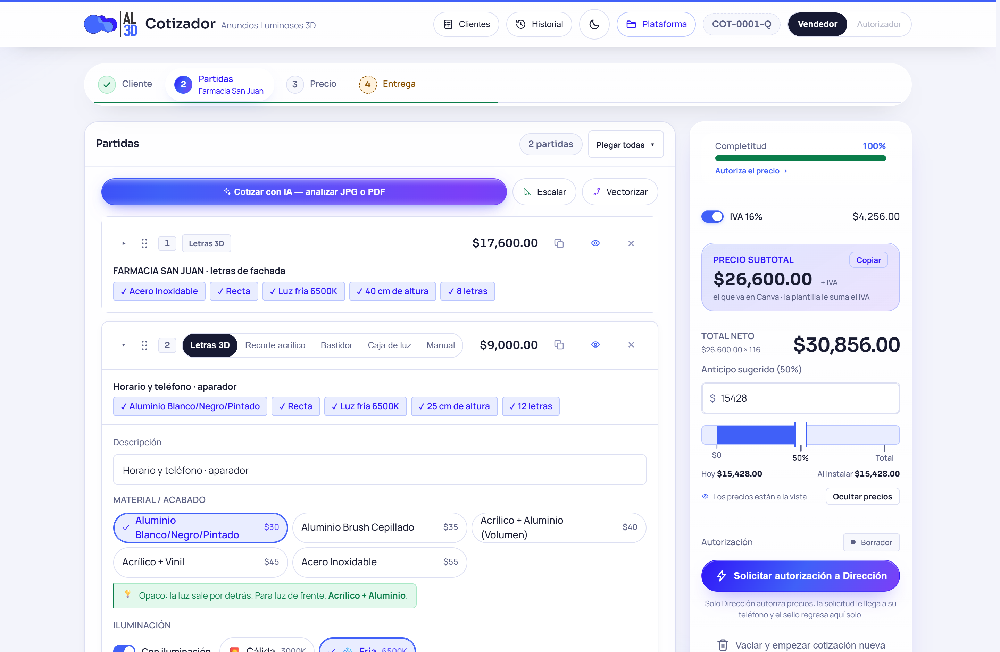
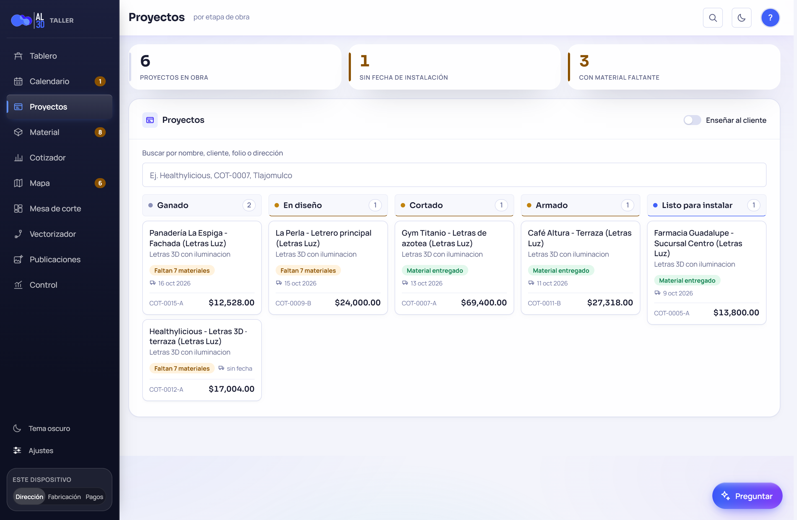
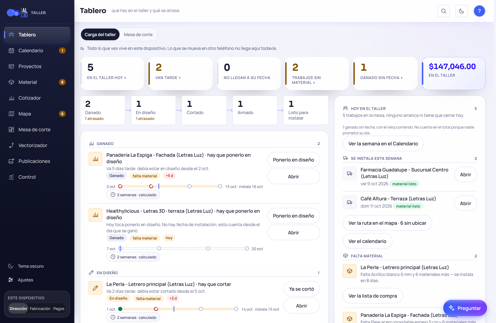

  <picture>
    <source media="(prefers-color-scheme: dark)" srcset="logo-al3d-oscuro.svg">
    
  </picture>

<h1 align="center">Cotizador AL3D</h1>

  <b>Se cotiza delante del cliente, y el taller se entera solo.</b> 
  Letras 3D, recorte de acrílico, bastidores y cajas de luz — del precio a la orden de trabajo.

  
  
  
  

---

  

## Qué es

Cuatro herramientas que comparten una sola puerta, un solo sistema de diseño y un solo conjunto
de archivos publicado:

| | Qué hace | Dónde vive |
|---|---|---|
| **Cotizador** | Captura el trabajo delante del cliente y saca el precio, el PDF y el WhatsApp | `#/cotizador` |
| **Plataforma** | Lo que pasa después: calendario, obra, material, mapa, cobranza | la raíz, `#/hoy` |
| **Mesa de corte** | Acomoda las piezas en la lámina antes de cortar (el anidador) | `#/anidador` |
| **Publicaciones** | Plantillas de marca para redes: textos y fotos encima, y baja PNG o video | `#/publicaciones` |

Todo corre en el navegador. **Sin servidor, sin cuenta, sin instalar nada y sin build**: son
archivos estáticos que se sirven tal cual, desde GitHub Pages
(`eliasgaribi-ctrl-z.github.io/cotizador-al3d/`) y desde Cloudflare Pages
(`cotizador-al3d.pages.dev`). Los datos viven en el dispositivo, y lo que tiene que ser de todos
—ventas, cobranza, almacén, autorizaciones— viaja a la hoja de Google del negocio.

### Lo más reciente (octubre de 2026)

- **La carpeta de los diseños, en la ficha del proyecto.** La hoja lee «Trabajos Pendientes» de
  Drive y cada proyecto del taller enseña su carpeta, el `.cdr` y el PDF de órdenes de
  fabricación. Tablero, Proyectos y el taller marcan **Órdenes listas / Sin órdenes / Sin
  carpeta**, y Dirección abre con un toque la carpeta que falte.
- **El PDF se parece al que se manda de verdad.** Cada partida lleva su plano —del escalador, con
  sus cotas, o subido ya acotado— y hasta dos renders; con varios planos salen hojas de Planos, y
  la hoja de **propuesta visual** junta hasta seis renders sin precios.
- **El teléfono se pide primero.** Los datos del cliente van en orden: teléfono, cliente, proyecto.
- **La puerta de Google entra animada**, con uno de dieciocho fondos que no se repite hasta que
  salieron todos, y **la sesión se cierra cada día**: así se sabe quién usó cada aparato.
- **Cambiar de pantalla se siente como ir a otro lugar**: la que se va sale hacia un lado y la
  nueva entra desde el suyo.
- **Las tarjetas que la hoja ya cobra** (COBRANDO / LIQUIDADO) pasan solas a «Instalado» y salen
  del tablero.

## El eslabón: de la cotización al taller

El cotizador termina en «autorizada» y ahí se detenía. Lo que venía después —que el cliente
diga sí, cuándo se instala, qué material comprar, cuánto deben— vivía en la cabeza de alguien.

Hoy, en *Registrar venta* hay un botón —**Registrar como proyecto ganado**— y del otro lado
aparece el proyecto completo: cliente, teléfono, dirección, el punto en el mapa sacado del link
de Google Maps, el tipo de trabajo derivado de las partidas, la fecha de instalación y **el
material que hay que comprar**. Nada de eso se captura.

  

## Lo que hace el cotizador

> El detalle completo —por qué cada pantalla es como es y qué se descartó— está en
> [`docs/FUNCIONES.md`](docs/FUNCIONES.md).

- **Cuatro pasos: Cliente · Partidas · Precio · Entrega.** La barra dice en cuál estás, cuáles
  están hechos y cuál no toca todavía. Ninguno se deshabilita: tocar el que no toca dice qué falta.
  En Cliente lo primero es el **teléfono**, luego el cliente y el proyecto.
- **Partidas por tipo** — letras 3D, recorte de acrílico, bastidor, caja de luz o captura manual,
  cada una con su catálogo de materiales y tarifas. Por debajo de 10 cm no hay letras 3D: la
  regla se aplica sola y la partida se convierte en recorte de acrílico, diciendo por qué.
- **Cotizar con IA** — analiza un JPG, PNG o PDF del proyecto y propone las partidas. Prueba en
  orden Qwen, DeepSeek y Gemini —el único que lee PDF—, reintenta sola cuando uno se satura y
  se puede cancelar sin cerrar nada. **Las llaves no viven en los teléfonos**: están en la hoja
  (⚡ AL3D → Llaves de IA) y cada consulta sale por el puente, a nombre de quien entró. Quitar a
  alguien de «Accesos» le quita también la IA.
- **Escalador** — mide sobre una foto o un plano sin cotas: se calibra con una referencia
  conocida y de ahí salen las demás medidas, con lupa para afinar con el dedo.
- **Vectorizador** — convierte el JPG del cliente en trazo de corte, a escala real, y saca los
  dos datos que mueven el precio: cuántas piezas son y qué alto tienen.
- **Autorización sellada en la hoja** — solo autoriza una cuenta de Google que la hoja tiene como
  Dirección; el nombre del autorizador es ese correo, no un campo que se teclea. Al autorizar,
  la hoja **recalcula el precio con su propia copia del catálogo** y, si no coincide con el del
  teléfono, no sella. Si coincide, firma el folio, el trabajo, el precio, el total y cada renglón
  del PDF, y lo anota en su pestaña «Autorizaciones». Sin señal no se autoriza: lo tecleado se
  queda para después.
  Quien cotiza sin ser Dirección **solicita**, y la solicitud le llega a Dirección a su teléfono,
  donde la revisa **renglón por renglón** —cada partida con su calculado y su precio autorizado,
  y el total sale de ellos— o, de atajo, le pone un total encima; el sello regresa solo con los
  dos. El precio vale mientras el trabajo no cambie (la huella); en cuanto
  cambia, vuelve al calculado, lo dice y ofrece **volver a autorizarlo** sobre el mismo folio.
- **Un QR que delata un PDF alterado** — la cotización sellada lleva un QR y un código. Cualquiera
  que lo escanee llega a `verificar.html`, que le pregunta a la hoja: auténtica, ya no vigente,
  revocada o no auténtica, con folio, fecha, total, negocio y **cada renglón** —descripción,
  piezas e importe— para compararlos con el papel. Un PDF con un renglón cambiado y el mismo total
  ya no pasa. Los sellos de antes de `puente-sheets-8` siguen verificando, y la página dice que
  esos solo responden del total.
- **PDF de cotización** con **un plano por partida** —la foto con las cotas del escalador, o un
  plano subido ya acotado— y hasta dos renders debajo de cada uno, la hoja de **propuesta
  visual** (hasta seis renders, sin precios), la orden de trabajo del taller y el recibo de pago
  con talón. Las imágenes se guardan aparte (IndexedDB) y la cotización solo lleva sus ids. Un
  descuento se le enseña al cliente; un aumento se reparte entre las partidas.
- **Deshacer con Ctrl+Z**, hasta 60 pasos, agrupando lo que se teclea seguido en un mismo campo.
  Borrar una partida o una cotización del historial se deshace desde el aviso.
- **Se porta como app** — las preguntas son de la app y no del navegador; en el teléfono las
  hojas se bajan con el dedo; dice cuando no hay señal (y que todo se sigue guardando), avisa
  cuando hay una versión nueva y se ofrece a instalarse.
- **Historial y cuadernos de cliente** — el historial contesta «¿qué cotizamos?»; el cuaderno,
  «¿quién es este y qué le hemos hecho?». No hay alta de clientes: se arma solo con lo capturado.
- **Los importes salen difuminados mientras es borrador**, porque se captura delante del cliente.
  Se espían manteniendo tocado, o con *Ver precios*.
- **Abrir la app no es recargar la página.** La cotización se guarda sola en cada tecla y una
  recarga la devuelve entera; pero al ABRIR la app, la de antes ya no se hereda en silencio: si
  ya estaba guardada en el historial, se empieza en blanco —con *Deshacer* a la mano—, y si es la
  única copia que existe se queda en pantalla con un aviso que dice **de quién es**. Así el
  trabajo nuevo deja de guardarse a nombre del cliente anterior.

## La plataforma

  

- **Calendario** — dos lentes: **Taller**, la fila de lo que está en fabricación con su ventana
  contada hacia atrás desde el día de instalación; e **Instalaciones**, el mes con su semáforo.
- **Tablero** — lo que se rompe primero, en orden: «falta material y esto se instala en 2 días».
- **Proyectos** — el tablero por etapa de obra, con la orden de trabajo de fabricación y **la
  carpeta de Drive del trabajo**: el `.cdr` con las escalas y el PDF de órdenes de fabricación.
  La carpeta se empareja por el nombre del negocio, con tolerancia a erratas, y lo que no alcanza
  el umbral no se adivina: la ficha lo dice y deja la liga a «Trabajos Pendientes».
- **Material** — de «8 letras de 40 cm de acero» a «1 lámina de acrílico, 44 módulos LED, 1
  fuente», con la cuenta a la vista y su etiqueta de confianza.
- **Mapa** — las obras por instalar y las instaladas, con el orden de ruta del día.
- **Mesa de corte y Vectorizador** — las herramientas del taller, como pestañas de la plataforma.
- **Publicaciones** — plantillas de marca para redes: se escriben los textos, se ponen las fotos
  y baja un PNG o un video. Ver [`publicaciones/README.md`](publicaciones/README.md).
- **Control** — el dinero: lo vendido contra el mes anterior, la conversión, los últimos doce
  meses, la cartera con el WhatsApp de cobro ya escrito, y la bitácora de quién movió qué. **El
  récord de ventas es el de la hoja de finanzas**: el puente baja la pestaña Ventas entera
  —también lo que se registró desde otro teléfono o en la propia hoja— y Control la suma con lo
  de este aparato, dice de cuándo son los datos y los vuelve a traer con un botón (y solo, al
  entrar, si tienen más de diez minutos).
- **El asistente** — un botón que flota en todas las pantallas. Las siete preguntas de siempre se
  contestan **aquí, sin IA y sin señal**; lo que no se puede calcular va a la IA sin teléfonos
  ni direcciones.

**Los recordatorios que sí suenan.** Cada instalación descarga un evento para el calendario del
teléfono, con alarmas a 3 días, 1 día y 30 minutos: las dispara el calendario, no la app, y por
eso suenan aunque nadie abra nada. Los demás avisos se calculan al abrir la plataforma.

**La hoja de cálculo es el libro mayor.** Los proyectos ganados, las fórmulas de comisión y la
cobranza viven en **«Finanzas AL3D — Ventas y Comisiones»**. La liga de su Apps Script ya viene
de fábrica y la llave es la cuenta de Google con la que se entra: Dirección apunta el correo y
el rol de cada persona en la pestaña «Accesos» de la hoja, y en el teléfono no hay que pegar
nada (el token de dispositivo de **Ajustes → El puente** queda de salida de emergencia, para
el día que Google no conteste). A partir de ahí la venta sale sola y el espejo del dinero baja solo — **y solo a quien le toca verlo**: al teléfono de
fabricación las cifras no le bajan. Baja también el **récord de ventas completo** de la hoja, que
es lo que Control suma: una fila que se borra allá desaparece de aquí en la siguiente bajada.
Desde `puente-sheets-10` la hoja lee además la carpeta de Drive **«Trabajos Pendientes»** y,
solo a Dirección, le abre carpeta al proyecto que no la tenga, sin duplicar.
Y desde `puente-sheets-9` viaja también **el almacén**: el libro de movimientos, el catálogo de
material y las listas de compra tienen su pestaña en la hoja («Almacén», «Catálogo de material»,
«Listas de compra»), así que lo que fabricación cuenta o recibe en su teléfono lo ve Dirección en
el suyo. Un movimiento no se descuenta dos veces —ni por un reintento ni porque dos teléfonos
corten el mismo proyecto—, el catálogo se escribe campo por campo, y pagos no mueve el almacén.
Sin puente no se rompe nada: la plataforma funciona completa en un dispositivo, y Control lo dice
en su primera línea. Los pasos están en [`puente/README.md`](puente/README.md).

## La mesa de corte (el anidador de vectores)

Antes de mandar las piezas al láser o al CNC conviene acomodarlas para gastar el menor material
posible. Vive en [su propia página](https://eliasgaribi-ctrl-z.github.io/cotizador-al3d/anidador-vectores/)
porque es del taller y no de la venta, y se llega desde la pestaña **Mesa de corte** de la plataforma o
desde **Acomodar en hoja** del vectorizador, que lo abre con el trazo ya puesto.

Trabaja en milímetros y lo que no es una medida lo pregunta: si el SVG declara mm, cm, pulgadas
o puntos se convierte solo; si viene en `px` —que en SVG no es una medida— se pide el ancho real
en vez de adivinar. Se detiene solo cuando lleva 25 intentos sin mejorar. Corre completo en el
navegador con [SVGnest](https://github.com/Jack000/SVGnest); ningún archivo se sube a un servidor.

## Uso

Todo corre en el navegador. Desde el celular conviene abrir la liga y agregarla a la pantalla de
inicio (Chrome → menú → *Agregar a pantalla principal*; iPhone → Safari → *Compartir* → *Agregar
a inicio*) para que quede como aplicación, a pantalla completa.

**Y abre sin señal.** La app guarda una copia de sí misma la primera vez que se abre con datos,
así que en la calle sigue arrancando y el historial, los folios y la cotización en curso siguen
alcanzables. Lo que sí necesita conexión es *Cotizar con IA*, y leer un PDF la primera vez de
cada sesión.

## Respaldar y mover los datos

Los datos se guardan localmente en cada dispositivo y **no se sincronizan entre ellos**. Eso se
pierde al borrar los datos del navegador, al cambiar de teléfono o cuando iOS limpia los sitios
que llevan semanas sin abrirse. La app lo pide sola: apunta la fecha del último respaldo y lo
nombra al autorizar si lleva más de treinta días o diez cotizaciones sin respaldarse.

En el pie del historial hay cuatro botones: **⬇ Respaldar** descarga un archivo con todo lo de
ese teléfono, **⬆ Restaurar** lo devuelve (y antes guarda solo un respaldo de lo que estaba),
**📄 CSV** exporta el historial para pegarlo en una hoja y **📓 Clientes** lo cruza por cliente.

El respaldo no lleva llaves de IA porque ya no hay ninguna en el teléfono: viven en la hoja.

> **Los folios llevan la letra del teléfono.** El contador es de cada aparato, así que dos
> teléfonos cuentan cada uno desde 1; por eso el folio termina en una letra —`COT-0042-B`— y dos
> clientes ya no tienen el mismo en la mano. La letra sale sola del id del aparato y se cambia en
> **Ajustes**: dale una distinta (A, B, C…) a cada teléfono que cotiza.

## Una sola puerta

| Por dónde se entra | A dónde llega |
|---|---|
| La liga de siempre, `…/cotizador-al3d/` | La **puerta de Google** y, ya adentro, el **Tablero** del taller, con el Cotizador como pestaña |
| El icono de la app instalada | El Tablero |
| Una liga vieja o un marcador a `cotizador.html` | Reenvía a `./#/cotizador` |
| `cotizador.html?solo=1` | El cotizador solo, sin la app alrededor. Lo usan las pruebas |
| Doble clic en `cotizador.html` desde el disco | El cotizador solo, como siempre |

Se entra con la cuenta de Google que Dirección dio de alta en la pestaña «Accesos» de la hoja, y
**la sesión se cierra sola cada día**: la primera apertura de un día nuevo vuelve a pedir la
cuenta. En el teléfono la barra de abajo lleva Tablero · Calendario · Proyectos · Cotizador · **Más**.

## Cómo está acomodado el código

    cotizador.html            solo el marcado (unas 1 100 líneas)
    css/sistema.css           EL sistema de diseño: tokens, estructura, las ocho capas
    css/plataforma.css        lo que solo la plataforma tiene (calendario, almacén, mapa)
    css/vidrio.css            la capa de vidrio, y va LA ÚLTIMA de las tres páginas: repinta
                              las dos familias y el cromado. Si se quita, la app vuelve a como estaba
    js/tema.js                claro, oscuro o el del sistema; corre antes del primer pintado
    js/piezas.js              las piezas compartidas de la interfaz, una sola vez para las cuatro
                              superficies: el aviso con mecha y pila, el botón que dice que está
                              trabajando, el total que rueda, el riel de pasos, las esquinas que
                              señalan, el letrero 3D… (docs/SISTEMA-DE-DISENO.md §6.7)
    js/cotizador/             el cotizador, por dominio y en el orden en que se carga:
      catalogo.js               precios — lo único que se edita a mano cuando sube el aluminio
      nucleo.js                 estado, modales, preferencias, clientes conocidos, cálculo
      partidas.js               agregar, plegar, heredar, pintar, chips y resumen
      proceso.js                los cuatro pasos, la autorización, la barra fija del teléfono
      ia.js                     cotizar con IA: la cadena de proveedores, el archivo, los reintentos (las llaves están en la hoja)
      entrega.js                logotipo, WhatsApp, hitos, Canva y el generador de PDF
      historial.js              historial, cuadernos, respaldo, cola, deshacer, folio
      escalador.js              medir sobre la foto
      venta.js                  registrar la venta y la vuelta a la plataforma
      vectorizador.js           imagen a trazo de corte
      notario.js                el sello de la hoja: quién eres, solicitar, autorizar, la cola remota
      arranque.js               init(), al final, porque llama a todos los demás
    js/app.js + js/mod/       la plataforma: router y sus módulos ES
    js/datos/, js/nucleo/     la capa de datos y las primitivas de pantalla

Los doce de `js/cotizador/` son scripts **clásicos** que comparten el ámbito global, como cuando
eran un solo `<script>`: los 156 manejadores en línea del marcado dependen de eso, y portarlos a
módulos ES los dejaría mudos sin un solo error. `pruebas/sintaxis.mjs` compila los doce y
`pruebas/publicacion.mjs` vigila que `arranque.js` siga siendo el último.

## Qué está cerrado y qué no

La app corre en el navegador, así que **lo que hay en un teléfono lo controla quien tiene el
teléfono**. Eso no cambia con ninguna pantalla de entrada. Lo que sí se cerró es que una
trampa hecha en el teléfono **pase por buena**:

| Qué | Dónde se decide |
|---|---|
| Quién entra y con qué rol | la hoja (pestaña «Accesos»), verificando el token de Google en cada petición |
| Qué columnas del dinero puede leer y escribir cada rol | la hoja (`PUENTE_ROLES`, `VE_EL_DINERO`) |
| Que un precio está autorizado, por quién y por cuánto | la hoja: recalcula el catálogo y firma (`/autorizar`) |
| Que un PDF es auténtico | la hoja, cuando alguien escanea su QR (`/verificar`) |
| Las llaves de IA y su cupo diario | la hoja (`/ia`) |
| Cuántas peticiones por minuto hace cada persona | la hoja: sesenta, en ventana fija de un minuto |
| Quién puede cancelar o consultar una solicitud de autorización | la hoja: quien la pidió, o Dirección (`/cancelar`, `/estado`) |
| A qué servidores puede hablar cada página | su `<meta>` de Content-Security-Policy (`pruebas/csp.mjs`) |
| Que nadie de afuera empotre la app | `js/tema.js`, el primer guion de todas las páginas |

Lo que sigue abierto, dicho: el catálogo y los datos de este aparato se pueden leer con las
herramientas del navegador de quien tenga el teléfono desbloqueado, y la plataforma admite
guiones en línea (`'unsafe-inline'`) porque el cotizador vive de sus manejadores en el marcado
(ver «Cómo está acomodado el código»).
Las cabeceras de `_headers` solo llegan cuando el sitio se sirve desde Cloudflare Pages; en
GitHub Pages no se leen, y por eso el «nadie nos empotra» también vive en `js/tema.js`.

**Cerrado en septiembre de 2026, además** (el detalle, en
[`puente/README.md`](puente/README.md#cómo-está-cerrado)):

- El cupo de sesenta por minuto se cuenta en **ventana fija**. Antes cada petición le volvía
  a dar un minuto de vida a la cuenta, y un teléfono que sincronizaba cada 30 s nunca la
  dejaba vaciarse: acababa fuera sin haber hecho nada raro.
- **Abono Comision** solo acepta importes positivos: uno negativo hacía subir la comisión
  pendiente.
- `/solicitar` ya no pisa la solicitud pendiente de otra persona, `/cancelar` solo la retira
  quien la pidió o Dirección, y `/estado` solo entrega un sello posterior a la última
  solicitud de quien pregunta.
- Los diálogos del menú ⚡ AL3D escapan el nombre del proyecto antes de pintarlo: corren con
  la sesión del dueño de la hoja, y un nombre con HTML dentro podía llamar funciones del script.
- Al sincronizar, **el estatus, la cuenta, la etapa, la dirección, el pin y el tipo** solo
  suben cuando son lo que cambió. Antes viajaban siempre y pisaban lo que PAGOS acababa de
  corregir en la hoja.

### El origen compartido

Es lo más grande que sigue abierto, y no se arregla con código de este repositorio.

La app vive en `https://eliasgaribi-ctrl-z.github.io/cotizador-al3d/`, y GitHub Pages sirve
**todos los repositorios de esa cuenta bajo el mismo origen**, `eliasgaribi-ctrl-z.github.io`.
El navegador separa por origen, no por carpeta: el `localStorage`, el IndexedDB y la caché del
service worker (CacheStorage) de esta app son también de cualquier otra página publicada desde
esa cuenta, y hay al menos otra (`tablero-inversionistas-thiqa`). Un XSS en cualquiera de
ellas —o un error en una dependencia que cargue— puede, sin tocar este repositorio:

- leer el **token de Google** de quien entró (`al3d_pf_gtok`): en el teléfono de Dirección es
  el que autoriza precios y ve todo el dinero, y vale hasta que caduca;
- leer el **token de dispositivo del puente** (`al3d_pf_puente`, en claro), que no
  caduca hasta que se generan otros;
- leer y cambiar el historial, las cotizaciones y los proyectos del aparato;
- **envenenar la caché del service worker**: dejar ahí su propia versión de un guion que la
  app sirve *caché primero*, y que sigue sirviéndose aunque la otra página ya se haya corregido.

Nada de la tabla de arriba lo frena. La CSP de cada página decide lo que *esa* página carga,
no lo que otra página del mismo origen lee. Y aun dentro de la app, `connect-src` permite
`https://script.google.com` entero, no el puente de AL3D: cabe cualquier Apps Script de
cualquier persona, así que la CSP **no limita la salida de datos** de un guion inyectado.

**Recomendación:** servir la app desde un origen que sea solo suyo —un dominio propio, o
`cotizador-al3d.pages.dev` como único origen— y, ya mudada, **quitar
`https://eliasgaribi-ctrl-z.github.io` de los orígenes autorizados** del cliente de OAuth en la
consola de Google. Mientras ese origen siga autorizado, cualquier página de la cuenta puede
pedirle a Google un token de esta app. Al mudarse hay que tocar también `ORIGENES` y `URL_APP`
en `js/nucleo/ingreso.js`, y el comentario de `PUENTE_CLIENT_IDS` en el `.gs`; y como el
almacenamiento es por origen, cada teléfono empieza vacío en el nuevo: respaldar antes aquí y
restaurar allá.

## Publicar

El sitio se sirve desde `main` y **es un solo conjunto de archivos que se promociona completo**.

> **Quién es quién.** La raíz —`index.html`— es **la app**: el Tablero, el calendario, el
> material, y el Cotizador como una de sus pestañas. `cotizador.html` es el cotizador, que la app
> empotra. Subir el cotizador como `index.html` borra la puerta de entrada.

1. Hacer commit a `main` (o fusionar el PR).
2. Si cambió `puente/hoja-apps-script.gs`, **publicar el puente antes que la app** — ver
   [`puente/DESPLIEGUE.md`](puente/DESPLIEGUE.md). Desde `puente-sheets-7` es obligatorio: la app
   nueva no autoriza sin el notario de la hoja. Con la 9, sin publicar el puente el almacén se
   queda esperando en cada teléfono (no se pierde) y «Probar» lo dice.
3. En **`sw.js`**, subir **`APP_VERSION`** una unidad. Es la primera línea de código del archivo.
   Sin eso, los teléfonos que ya tienen la app siguen sirviendo la versión guardada.
4. Esperar de 30 a 60 segundos a que GitHub Pages redespliegue. La copia de Cloudflare Pages
   (`cotizador-al3d.pages.dev`) es la misma app; cómo y cuándo se redespliega no está escrito
   en este repositorio (ver [`puente/DESPLIEGUE.md`](puente/DESPLIEGUE.md)), así que conviene
   abrirla y confirmar la versión nueva también ahí.

Son ciento once archivos que se cargan en orden y se llaman entre sí, servidos *caché primero*: con
mala señal llegarían mezclados, y **un guion nuevo con uno viejo no es una app vieja, es una app
rota**. Por eso el conjunto se cambia completo o no se cambia.

Si cambia el catálogo de precios (`js/cotizador/catalogo.js`), hay que regenerar su copia para la
plataforma con `herramientas/extraer-catalogo.sh`. Si `pruebas/publicacion.mjs` dice que las
cifras de la documentación se quedaron atrás (los manejadores en línea del cotizador), las pone
al día `node herramientas/recontar.mjs`.

## Pruebas

    pruebas/correr.sh               51 archivos, solo node, unos segundos
    pruebas/correr.sh --navegador   44 más, que piden Chromium y un servidor

Una de ellas revisa que el sitio *se pueda publicar*; otra corre el Apps Script del puente entero
contra una hoja de mentiras, sin cuenta y sin red; otra rasteriza cada pieza y **cuenta sus
píxeles** para comprobar que nada de lo que lleva texto baja de 4,5:1 de contraste.

## Documentación

| Documento | Qué contiene |
|---|---|
| [`docs/FUNCIONES.md`](docs/FUNCIONES.md) | El cotizador por dentro: por qué cada pantalla es como es |
| [`docs/ARQUITECTURA.md`](docs/ARQUITECTURA.md) | El contrato completo: fases, modelo de datos, cada módulo |
| [`docs/SISTEMA-DE-DISENO.md`](docs/SISTEMA-DE-DISENO.md) | Tokens, escalas y las ocho capas de `css/sistema.css` |
| [`docs/INVESTIGACION-TECNICA.md`](docs/INVESTIGACION-TECNICA.md) | Lo que se verificó antes de decidir: OAuth, cuotas, límites |
| [`docs/ESTRUCTURA-COTIZACION-CANVA.md`](docs/ESTRUCTURA-COTIZACION-CANVA.md) | El papel que se manda de verdad, hoja por hoja |
| [`docs/REVISAR-PAQUETE-UI.md`](docs/REVISAR-PAQUETE-UI.md) | Lo que quedó por revisar del paquete de UI, y las decisiones abiertas |
| [`puente/README.md`](puente/README.md) | El puente a la hoja: caminos, roles y cómo está cerrado |

## Pendientes

- **El neón flex se vende y no está en ningún catálogo.** Cae en partida *manual*, que es justo
  la que el módulo de material excluye por diseño. Es un hueco de negocio: falta decidir cómo se
  cobra.
- **Mandar una cotización con opciones sin elegir.** Hoy se puede autorizar con aluminio,
  acrílico y caja de luz lado a lado «de todos modos». Falta decidir si se deja así o se cierra
  (ver [`docs/REVISAR-PAQUETE-UI.md`](docs/REVISAR-PAQUETE-UI.md)).
- **Nada se ha probado en un teléfono real.** Los gestos se ejercitaron en Chromium; falta un
  Android de gama media y un iPhone.

---

AL3D · Anuncios Luminosos 3D · Guadalajara, Jalisco

